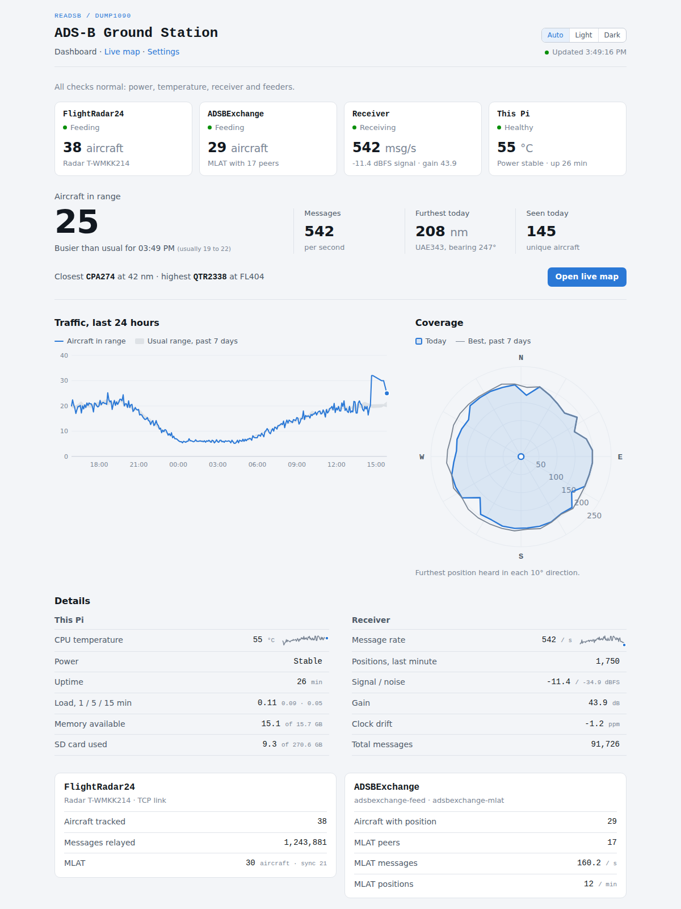
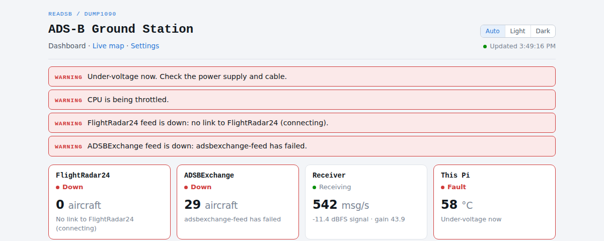
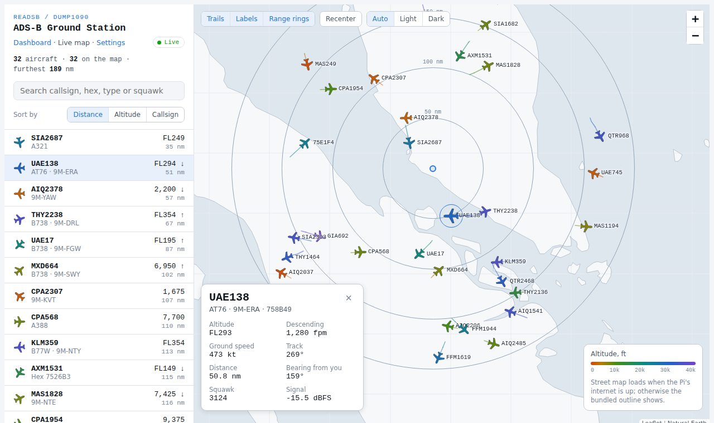

# ADS-B Pi Dashboard

Keep an eye on your Raspberry Pi ADS-B feeder. One page on your home network
tells you whether the Pi is healthy, whether it's still feeding
FlightRadar24 and ADSBExchange, and whether your receiver is hearing as much
as it usually does. When something goes wrong, it says so at the top.

[](https://github.com/amirsubhi/adsb-pi-dashboard/actions/workflows/ci.yml)
[](LICENSE)


<picture>
  <source media="(prefers-color-scheme: dark)" srcset="docs/screenshots/dashboard-dark.png">
  
</picture>

<sub>Screenshots use the bundled receiver simulator and sample history.</sub>

## Why

If you feed FlightRadar24 and ADSBExchange from one Pi, their status is
spread around: `fr24feed-status` in a terminal, the MLAT client's log,
`vcgencmd` for power, graphs1090 for reception. A weak power supply, a feeder
that stopped overnight or a receiver hearing half its usual traffic can go
unnoticed until you check each one.

This dashboard reads all of them on the Pi and puts them on one page. It
doesn't replace tar1090 or graphs1090; it's the page you open to see whether
everything is still working.

- **One Python file, nothing to install.** Standard library only, no pip, no
  database server. History lives in a single SQLite file.
- **Runs on the Pi, works offline.** Nothing is loaded from the internet, so
  the page still works when the Pi's connection doesn't.
- **Quiet until something is wrong.** A normal day shows a single line.

## Contents

- [What it monitors](#what-it-monitors)
- [Quick start](#quick-start)
- [Requirements](#requirements)
- [Installing, updating and removing](#installing-updating-and-removing)
- [Using it](#using-it)
- [Settings](#settings)
- [Troubleshooting](#troubleshooting)
- [Privacy and security](#privacy-and-security)
- [API](#api)
- [Development](#development)
- [Credits and licence](#credits-and-licence)

## What it monitors

### Alerts

<picture>
  <source media="(prefers-color-scheme: dark)" srcset="docs/screenshots/alerts-dark.png">
  
</picture>

On a normal day one line says all checks are normal. Under-voltage, CPU
throttling, overheating, a stalled receiver or a feeder going down appear as
warnings at the top, worst first, each saying what to do. A feeder has to stay down for a minute or two before it
raises an alarm, so a restart or a dropped connection that recovers on its
own stays quiet, and feeder alarms are held back for five minutes after boot.

Under the alerts, four tiles answer "is it working?" at a glance:
**FlightRadar24**, **ADSBExchange**, **Receiver** and **This Pi**, each with
its state, one key figure and the reason when something is wrong. Tiles
change straight away; the alert strips wait as described above. The figures
behind each tile are further down, under Details.

### Feeders

- **FlightRadar24** (`fr24feed`): whether fr24feed is running and reading
  your receiver, its link to FlightRadar24 and link type, your radar ID,
  aircraft tracked, messages relayed and MLAT sync count.
- **ADSBExchange** (`adsbexchange-feed`, `adsbexchange-mlat`): whether the
  feed service is running, aircraft with a position, and the MLAT client's
  peers, message rate and positions per minute.
- A feeder you don't use is greyed out as "Not installed", not reported as a
  fault.

### The Pi

- **Power:** under-voltage right now, or earlier since the last boot, with
  the time of the last event (from the Raspberry Pi firmware and kernel log).
- **CPU throttling and temperature,** with a 6-hour trend.
- **Load, memory, SD card space and uptime.**

### Reception

- **Message rate** (with a 6-hour trend), positions per minute, signal and
  noise level, gain and clock drift.
- **Aircraft in range against the usual** for that time of day, plus a
  24-hour traffic chart over the past week's range, so a drop in reception
  stands out from a quiet hour.
- **Coverage:** the furthest position heard in each 10° direction, today
  against your best this week. A shape that shrinks can point to an antenna,
  cable or gain problem; a dent that's always there is usually terrain or a
  building.
- **Furthest and unique aircraft today.**

### History

Every aircraft sighting with first and last seen, duration, highest altitude
and fastest speed, kept for 30 days and filterable by the last 2 hours, 24
hours or 7 days.

### Also included

- **Settings page** (`/settings`): every setting in effect and where it came
  from, plus station checks for the usual setup problems (receiver data
  missing or stale, no receiver position, journal not readable, low disk).
- **A simple live map** (`/map`): the aircraft your receiver hears right now,
  in the same style as the dashboard, with a bundled coastline so it works
  offline. It's a quick look; for full aircraft tracking keep using
  [tar1090](https://github.com/wiedehopf/tar1090), which most feeder images
  already include.

<details>
<summary>Show the live map</summary>

<picture>
  <source media="(prefers-color-scheme: dark)" srcset="docs/screenshots/map-dark.png">
  
</picture>
</details>

All pages have **Auto / Light / Dark** themes and work on phones.

## Quick start

On the Pi that runs your receiver:

```bash
git clone https://github.com/amirsubhi/adsb-pi-dashboard.git
cd adsb-pi-dashboard
./install.sh
```

The installer asks two questions (your transition altitude, and your receiver
position if readsb doesn't report it), starts the service, and prints the
address to open, for example `http://192.168.1.50:8099/`.

## Requirements

- **A receiver decoder that writes JSON files:** [readsb](https://github.com/wiedehopf/readsb)
  (default folder `/run/readsb`) or dump1090-fa (`/run/dump1090-fa`; set
  `readsb_dir`).
- **Python 3.7 or newer.** Tested on 3.9, 3.11 and 3.13, the versions shipped
  with Raspberry Pi OS Bullseye, Bookworm and Trixie.
- **Linux with systemd** for the service. Without systemd you can still run
  `python3 app.py` yourself.
- **Optional:** `fr24feed`, `adsbexchange-feed` / `adsbexchange-mlat`. A
  feeder that isn't installed shows as "Not installed" instead of an error.
- **Optional:** Raspberry Pi firmware tools (`vcgencmd`) for under-voltage and
  throttling checks. Other boards fall back to the kernel's temperature sensor.

It was built on the [ADSBExchange Raspberry Pi image](https://www.adsbexchange.com/how-to-feed/)
with `fr24feed` added, but nothing depends on that image beyond default paths.

## Installing, updating and removing

`./install.sh` does the following, as your normal user, using `sudo` only for
the systemd steps:

1. Copies the program into `~/adsb-dashboard` (or `$ADSB_DATA_DIR`).
2. On the first install, creates `~/adsb-dashboard/settings.ini` and asks
   for your transition altitude and, if needed, receiver position. Settings
   from an older version's service file are moved into it.
3. Installs and starts the `adsb-dashboard` systemd service under your user,
   sandboxed so it can only write to its own folder.
4. Prints the dashboard address, and a note if the Pi's clock is on UTC.

**Update** by pulling and running the installer again. Your settings and
flight history are kept, and the database is upgraded in place.

```bash
cd adsb-pi-dashboard
git pull
./install.sh
```

**Remove** the service with `./uninstall.sh`. It leaves `~/adsb-dashboard`
(settings and history) in place; delete that folder too if you want them gone.

**Without systemd,** run it directly. It listens on port 8099 and uses
`~/adsb-dashboard` for its files:

```bash
python3 app.py
```

## Using it

### Reading the dashboard

When everything is fine, the line under the header reads *All checks normal:
power, temperature, receiver and feeders.* Otherwise one strip appears per
problem, warnings first. "After" is how long a problem must last before it
shows:

| Strip | Meaning | After | What to do |
|---|---|---|---|
| WARNING · Under-voltage now | The Pi isn't getting enough power right now | at once | Use a proper 5 V / 3 A supply and a short, thick cable |
| WARNING · CPU is being throttled | The firmware has slowed the CPU | at once | Check power and cooling |
| WARNING · No data from the receiver | readsb hasn't updated `aircraft.json` for a minute, or it isn't there | 1 min | `systemctl status readsb`; check the dongle is plugged in (`lsusb`) |
| WARNING · FlightRadar24 feed is down | fr24feed is stopped, has no link to FlightRadar24, or gets nothing from the receiver; the strip says which | 2 min | `sudo systemctl restart fr24feed`, then `fr24feed-status` |
| WARNING · ADSBExchange feed is down | The `adsbexchange-feed` service is stopped, failed or keeps restarting | 90 s | `sudo systemctl restart adsbexchange-feed`, then `journalctl -u adsbexchange-feed` |
| CAUTION · FlightRadar24 / ADSBExchange MLAT isn't working | The feed works but MLAT doesn't (not running, not connected, or no report for 30 minutes) | 10 min | `journalctl -u adsbexchange-mlat`, or `fr24feed-status` for FR24 |
| CAUTION · CPU at 75 °C | Running hot (75 °C or more) | at once | Add a heatsink or fan, or improve airflow |
| CAUTION · CPU running warm | 70 °C or more | at once | Keep an eye on it, especially in hot weather |
| CAUTION · Power dipped earlier this boot | Under-voltage happened since the last reboot | at once | Same as under-voltage; it may come back |
| CAUTION · SD card nearly full | Less than 1 GB free, or more than 90 % used | at once | Clear old logs (`sudo journalctl --vacuum-size=100M`) or lower `retain_days` |
| CAUTION · The collector hit an error | Reading the Pi's status failed, so figures may be old | at once | `journalctl -u adsb-dashboard` |

**Status tiles.** Green "Feeding" means the feed is working; amber "MLAT
off" means it feeds but MLAT doesn't; red "Down" or "Stopped" means nothing
is reaching that site, with the reason underneath. The Receiver tile turns
red when readsb stops updating, and This Pi shows "Check" (amber) or "Fault"
(red) along with the matching alert. Tiles change straight away; the alert
strip waits as in the table above. MLAT figures that stay at zero
while the feed runs usually mean the MLAT client can't sync; check
`journalctl -u adsbexchange-mlat`.

**Is reception normal?** "Busier or quieter than usual" compares the current
aircraft count with the range seen at the same time of day over the past
week; the grey band on the traffic chart is that same range (it appears after
two days of data). If the count sits below the band for hours, or the
coverage shape shrinks, check the antenna, cable and gain.

**Flight levels.** Altitudes above your transition altitude show as flight
levels (`FL350` = 35,000 ft). Set `transition_alt` for your country; the
installer asks for it.

### The live map

Click a plane, or a row in the list, for its details. Search matches
callsign, hex code, registration, type or squawk. Colours show altitude, red
marks an emergency squawk (7500, 7600, 7700), and the **Live** indicator
turns red if data stops arriving. The street map comes from OpenStreetMap
when the Pi has internet (see [Map backgrounds](#map-backgrounds)); otherwise
the bundled coastline shows.

## Settings

Settings live in `~/adsb-dashboard/settings.ini`. Every option is listed there
with its default, commented out. To change one:

```bash
nano ~/adsb-dashboard/settings.ini      # remove the # and set the value
sudo systemctl restart adsb-dashboard
```

Then open **Settings** in the dashboard to check the new value and where it
came from.

| Option | Default | What it does |
|---|---|---|
| `port` | `8099` | Port the dashboard listens on |
| `bind` | `0.0.0.0` | Address to listen on; `127.0.0.1` for this Pi only |
| `readsb_dir` | `/run/readsb` | Folder with `aircraft.json` and `stats.json` |
| `adsbx_dir` | `/run/adsbexchange-feed` | Folder with ADSBExchange's `status.json` |
| `poll_interval` | `15` | Seconds between samples for the dashboard and history |
| `session_gap` | `300` | Seconds an aircraft can be out of range before its next sighting counts as new |
| `retain_days` | `30` | Days of history and statistics to keep |
| `receiver_lat`, `receiver_lon` | not set | Receiver position, if readsb doesn't report it |
| `transition_alt` | `18000` | Feet above which altitudes show as flight levels (Malaysia 11000, UK 6000, USA 18000) |
| `show_exact_location` | `no` | Show exact receiver coordinates instead of rounding to about 1 km |
| `map_tiles` | `osm` | Live map background: `osm`, `carto` or `off` |
| `carto_key` | not set | Free CARTO key, for `map_tiles = carto` |
| `cors_origin` | not set | One other website allowed to read the API |

Each option also has an environment variable (shown on the Settings page and
in `settings.ini`) that overrides the file. `ADSB_DATA_DIR` chooses the data
folder and can only be set that way.

> [!NOTE]
> **Why the settings page is read-only.** The dashboard has no login. A page
> that could change settings could be used by anything on your network, and
> even by a website open in your browser. Editing a file over SSH avoids that.

### Map backgrounds

- **`osm`** (default): OpenStreetMap's standard map. No key needed; darkened
  in dark mode.
- **`carto`**: CARTO's purpose-made light and dark maps. Since September 2026
  these need an API key, free for personal use: request one at
  [carto.com/basemaps/apikey](https://carto.com/basemaps/apikey), then set
  `map_tiles = carto` and `carto_key = <your key>`.
- **`off`**: only the bundled coastline outline. Nothing is loaded from the
  internet.

The outline is always there underneath, so the map still works when the Pi
is offline.

## Troubleshooting

Open **Settings** first. Its station checks name most problems directly. The
service log is the next stop:

```bash
journalctl -u adsb-dashboard -f
```

<details>
<summary><b>"Receiver data: no aircraft.json" or the aircraft list is empty</b></summary>

The dashboard can't find your decoder's output. Look for it:

```bash
ls /run/readsb /run/dump1090-fa 2>/dev/null
```

Set `readsb_dir` to the folder that contains `aircraft.json`, then restart.
If the file exists but is old, your decoder isn't running:
`systemctl status readsb` (or `dump1090-fa`).
</details>

<details>
<summary><b>No distances, range rings or coverage</b></summary>

These need the receiver's position. Most readsb setups report it; if yours
doesn't, set `receiver_lat` and `receiver_lon` in `settings.ini`.
</details>

<details>
<summary><b>MLAT figures stay empty, or "System journal" shows a warning</b></summary>

The service reads MLAT figures from the system journal. Run `./install.sh`
again: it gives the service the `systemd-journal` and `adm` groups when they
exist on your system.
</details>

<details>
<summary><b>"Pi firmware tools" warning, or power always shows "—"</b></summary>

`vcgencmd` needs the `video` group, which the installer adds when it exists.
Run `./install.sh` again. On boards other than a Raspberry Pi this check is
simply off.
</details>

<details>
<summary><b>A feeder shows "Not installed" but it is installed</b></summary>

The dashboard looks for the systemd services `adsbexchange-feed` and
`adsbexchange-mlat`, and for the `fr24feed-status` command. If your system
names them differently, please open an issue with the names.
</details>

<details>
<summary><b>The live map shows only the outline, no streets</b></summary>

The Pi has no internet access, `map_tiles` is `off`, or the browser can't
reach the tile server. With `map_tiles = carto`, tiles reading "API KEY
REQUIRED" mean `carto_key` is missing or wrong.
</details>

<details>
<summary><b>Times are wrong, or "today" resets at the wrong hour</b></summary>

The Pi's clock is probably on UTC. Set your time zone and restart:

```bash
sudo timedatectl set-timezone Asia/Kuala_Lumpur
sudo systemctl restart adsb-dashboard
```
</details>

<details>
<summary><b>No grey "usual range" band on the traffic chart</b></summary>

It needs two days of history for each time of day, so it appears after the
dashboard has been running for two days.
</details>

## Privacy and security

The dashboard is meant for a home network:

- **It has no login, so don't port-forward it to the internet.** For access
  from outside, use a VPN such as [Tailscale](https://tailscale.com) or WireGuard.
- Other websites open in your browser can't read its data.
- The receiver position is rounded to about 1 km on the pages, so screenshots
  don't reveal your address. Set `show_exact_location = yes` to change that.
- Every script comes from the Pi itself. The only outside requests are the
  live map's street tiles, which let OpenStreetMap or CARTO see your IP address
  and the area you're viewing; `map_tiles = off` stops them.
- The service runs as your user in a systemd sandbox that can only write to
  its own folder.

See [SECURITY.md](SECURITY.md) for details and how to report a problem.

## API

The pages read the same JSON API that you can use for your own projects.

<details>
<summary>Endpoints</summary>

| Endpoint | Returns |
|---|---|
| `GET /api/status` | Current snapshot: Pi vitals, receiver figures, feeders, aircraft, message rate, unique aircraft and furthest aircraft today |
| `GET /api/history?hours=24` | Sightings with `last_seen` in the last N hours, newest first (up to 400) |
| `GET /api/metrics?hours=6&step=300` | Samples of `temp_c`, `aircraft_count`, `msg_rate`, `max_range_nm`; `step` (10 to 3600 s) averages them |
| `GET /api/typical` | Usual aircraft-count range per 15-minute slot over the past 7 days (`null` where under 2 days of data) |
| `GET /api/coverage` | Furthest distance in nm per 10° direction, today and best of the past 7 days |
| `GET /api/aircraft` | Live aircraft from `aircraft.json`: position, altitude (`"ground"` on the ground), speed, track, vertical rate, squawk, signal, registration and type |
| `GET /api/trails` | The last 5 minutes of positions per aircraft, as `[lat, lon, altitude, time]` |
| `GET /api/map-config` | Receiver position, transition altitude and map background for the map page |
| `GET /api/settings` | Settings in effect and the station checks |

Responses are JSON. An invalid parameter returns `400` with an `error`
message. Browsers on other sites can't read the API unless you set
`cors_origin`.
</details>

## Development

Everything is standard-library Python, so there's nothing to install. A
simulated receiver lets you work without an antenna:

```bash
python3 tools/fake_readsb.py --dir /tmp/fake-readsb &
ADSB_DATA_DIR="$PWD" ADSB_READSB_DIR=/tmp/fake-readsb python3 app.py
# open http://localhost:8099/

python3 -m unittest discover -s tests -v
shellcheck install.sh uninstall.sh
```

GitHub Actions runs the tests on Python 3.9, 3.11 and 3.13 and checks the
shell scripts on every push and pull request. See [CONTRIBUTING.md](CONTRIBUTING.md)
for the project's rules and [CHANGELOG.md](CHANGELOG.md) for what changed in
each version.

<details>
<summary>Project layout</summary>

```
app.py                  the server: collector, history store and web server
dashboard.html          dashboard page
map.html                live map page
settings.html           settings and station checks page
static/                 the pages' JavaScript (theme, dashboard, map, settings)
vendor/                 bundled Leaflet and topojson-client, with licences
geo/                    bundled Natural Earth coastline data, with licence
settings.example.ini    every setting, documented; copied to settings.ini
install.sh, uninstall.sh, systemd/   the service
tools/fake_readsb.py    simulated receiver for development
tests/                  unit tests and fixtures
```
</details>

## Credits and licence

The live map uses [Leaflet](https://leafletjs.com). Its offline outline is
[Natural Earth](https://www.naturalearthdata.com) data, packaged by
[world-atlas](https://github.com/topojson/world-atlas) and read with
[topojson-client](https://github.com/topojson/topojson-client). Street maps
are © [OpenStreetMap](https://www.openstreetmap.org/copyright) contributors,
and © [CARTO](https://carto.com/attributions) when you use CARTO's. The
dashboard reads what [readsb](https://github.com/wiedehopf/readsb) writes and
borrows ideas from tar1090 and graphs1090.

This project is MIT licensed; see [LICENSE](LICENSE). Bundled third-party files
keep their own licences, listed with versions and checksums in
[THIRD_PARTY_NOTICES.md](THIRD_PARTY_NOTICES.md).
